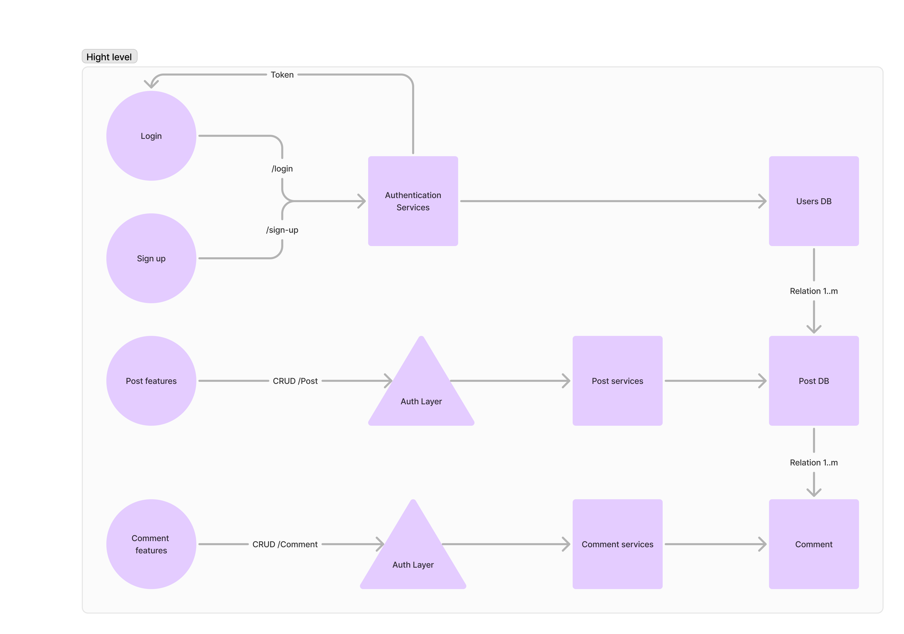

# octopus-in-sea

From project breakdown There are 3 main functional. 

### Functional
1. Authentication/ Login
2. Posting to dashboard
3. Comment
### Non-functional
1. UI responsive
2. UX proper

I have design high level architecture below: 

I have using Next.js, Nest.js and mongodb to use posting services base on idea type of documents work well more than SQL (Vertical scaling).

For additional on Authentication I have used cookies with JWT to utilize access_token for both services instead of using name as requirement

For front end project i have designed to have seperate layout between non-auth and authentication. 
I only used pure components instead of library because we use not pretty much comment. I might easy to create and reduce redundant from using large css

### Adjustable task
- Unit test on backend
- UI align to design 
- Experience during make call to action
- Make cleaner reusable components
- Clean unused